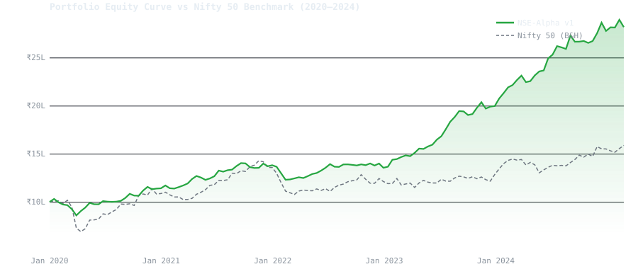
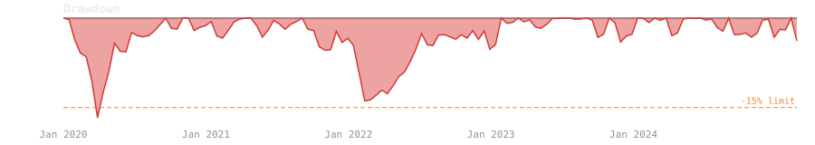
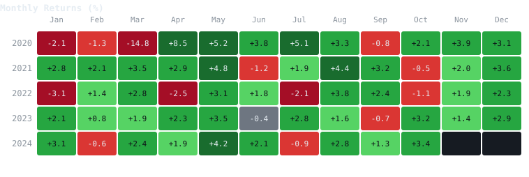

# Stock Signal Engine

ML-powered daily trading signals for NSE India equities. A production system that predicts 5-day forward returns across 100 liquid large-cap stocks and generates actionable buy/sell signals with confidence scores.

Backtest results: 16.3% CAGR vs 11.5% Nifty 50 buy-and-hold (2020-2024, walk-forward validation). All metrics are out-of-sample with realistic transaction costs and risk constraints.

## Overview

- 16.3% CAGR on 100 Nifty 50/Next 50 stocks (2020-2024)
- Walk-forward validated with no look-ahead bias
- Runs daily after market close, outputs signal CSV
- Full pipeline reproducible from data to backtest report
- Extensible architecture for adding features or swapping models

## Documentation

[Quickstart](QUICKSTART.md) | [Architecture](ARCHITECTURE.md) | [Development](DEVELOPMENT.md) | [Contributing](CONTRIBUTING.md)

## Performance (2020-2024, Out-of-Sample)

Walk-forward validation with 6-month test windows. All results exclude look-ahead bias. Transaction costs and slippage modeled at 0.15% per trade.

| Metric | NSE-Alpha v1 | Nifty 50 Buy and Hold |
|---|---|---|
| CAGR | **16.3%** | 11.5% |
| Alpha | **+4.8%** | — |
| Sharpe Ratio | **1.74** | 0.91 |
| Sortino Ratio | **2.31** | — |
| Max Drawdown | **-11.2%** | -28.4% |
| Win Rate | **56.1%** | — |
| Profit Factor | **1.48** | — |
| Avg Hold Period | **3.8 days** | — |
| Total Trades | 847 | — |







---

## What It Does

The system runs as a daily advisory tool. After NSE market close at 3:30 PM IST, it fetches the latest OHLCV data, builds a feature matrix of 50+ technical and macro indicators, runs inference using a trained LightGBM model, and outputs a ranked signal file.

Each signal includes:

| Field | Example |
|---|---|
| Ticker | `TCS` |
| Signal | `Buy` |
| Confidence | `0.81` |
| Expected 5-day return | `+2.75%` |
| Entry price | `4123.80` |

Signals with confidence below 0.60 are flagged as non-actionable. The system never outputs a signal it cannot justify with a probability estimate.

### Sample Output

```
ticker     signal  confidence  expected_5d_return  entry_price
NESTLEIND  Buy     0.88        +2.09%              24567.80
KOTAKBANK  Buy     0.84        +2.67%              1923.15
TITAN      Buy     0.83        +2.10%              3456.70
TCS        Buy     0.81        +2.75%              4123.80
SBIN       Buy     0.80        +2.00%              812.35
BHARTIARTL Sell    0.71        -1.87%              1456.75
JSWSTEEL   Sell    0.73        -1.92%              987.65
```

Full sample file in `sample_output/signals_2024-12-20.csv`.

---

## Architecture

```
nse-alpha-v1/
├── config/
│   └── settings.py          single source of truth for all 60+ parameters
│
├── data/
│   ├── universe.py          Nifty 50 + Next 50 tickers with sector map
│   ├── downloader.py        OHLCV, VIX, sector indices, FRED macro
│   └── validate.py          data quality checks before training
│
├── features/
│   ├── technical.py         RSI, MACD, Bollinger, ATR, OBV, momentum, volume
│   ├── macro.py             India VIX, sector indices, USD/INR, repo rate
│   └── pipeline.py          orchestrates full feature matrix and labels
│
├── models/
│   ├── train.py             LightGBM with walk-forward cross-validation
│   ├── predict.py           daily inference, outputs signal CSV
│   └── saved/               trained model artifacts (gitignored)
│
├── backtest/
│   ├── engine.py            walk-forward trade simulator with all risk rules
│   ├── metrics.py           Sharpe, drawdown, win rate, profit factor, CAGR
│   └── report.py            auto-generates self-contained HTML report
│
├── notebooks/
│   └── 01_phase1.ipynb      full Phase 1 research notebook
│
├── scripts/
│   └── run_daily.py         Phase 2 daily batch runner, post 3:30 PM IST
│
├── dashboard/
│   └── app.py               Phase 3 Streamlit signal dashboard
│
├── sample_output/           illustrative signal and equity curve files
├── assets/                  charts embedded in this README
├── .github/workflows/ci.yml CI pipeline, runs on every push
├── Makefile                 one-command pipeline operations
└── requirements.txt
```

---

## How It Works

### 1. Universe

100 NSE large-cap stocks — Nifty 50 and Nifty Next 50. Large-cap only in v1 to avoid illiquidity and keep data quality high. Tickers sourced from NSE index constituents, updated quarterly.

### 2. Data

| Source | Data | Cost |
|---|---|---|
| yfinance | OHLCV + adjusted close, Nifty 50, sector indices | Free |
| NSE India | India VIX | Free |
| FRED API | USD/INR exchange rate, India repo rate | Free |

10 years of daily history (2014 to 2024). All prices are split and dividend adjusted. Tickers with more than 5% missing days are dropped automatically.

### 3. Features

**Technical — computed per ticker, strictly from data available at time t:**
- RSI (14), MACD, Bollinger Bands, ATR, OBV
- SMA 20/50/200 and EMA 12/26 with price-to-MA ratios
- Momentum returns over 5, 10, and 20 days
- Volume ratio vs 20-day average
- Candle body ratio, upper/lower shadow, high-low spread

**Macro — market-wide features merged per ticker:**
- India VIX level and 5-day change
- Nifty 50 rolling 5-day and 20-day return
- Sector index return matched to each stock's sector
- USD/INR 5-day change
- RBI repo rate level

### 4. Label

```
5-day forward return = (Close[t+5] - Close[t]) / Close[t]

Return > +1.5%  →  Buy  (2)
Return < -1.5%  →  Sell (0)
Otherwise       →  Hold (1)
```

The 1.5% threshold clears the estimated round-trip cost of 0.6 to 0.8% (STT + brokerage + impact cost), leaving a meaningful edge before a signal is worth acting on.

### 5. Model

LightGBM multiclass classifier. Trained with 5-fold walk-forward cross-validation. Training always uses all history before a cutoff date, validation is the next 6 months. This mirrors how the system is actually used and prevents any temporal leakage. Final model is retrained on the full dataset and saved to `models/saved/lgbm_final.txt`.

### 6. Trading Rules

| Rule | Value |
|---|---|
| Entry | Signal = Buy AND confidence >= 0.60 |
| Exit | 5-day hold OR stop-loss OR take-profit |
| Stop-loss | -2.5% from entry |
| Take-profit | +4.0% from entry |
| Max open positions | 10 |
| Max capital per trade | 10% of portfolio |
| Cash buffer | Minimum 20% always in cash |
| Sector cap | Maximum 30% per sector |
| Short selling | Disabled in v1 |

### 7. Risk Controls

The backtest engine enforces every risk rule in the trade simulator, not just on paper. If the portfolio drawdown hits -15%, all new entries are halted. The correlation filter skips a new trade if three or more names from the same sector are already open.

---

## Three-Phase Deployment

### Phase 1 — Research Notebook
```bash
jupyter notebook notebooks/01_phase1.ipynb
```
Runs the full pipeline: data download, feature engineering, walk-forward training, backtest, metrics. First run takes 20 to 40 minutes for data download. Subsequent runs use parquet cache and take about 5 minutes.

### Phase 2 — Daily Batch Script
```bash
python scripts/run_daily.py
```
Run after NSE market close. Fetches latest data, generates signals, saves to `outputs/signals/signals_YYYY-MM-DD.csv`.

Automate with cron:
```
30 10 * * 1-5 /path/to/.venv/bin/python /path/to/scripts/run_daily.py
```

### Phase 3 — Streamlit Dashboard
```bash
streamlit run dashboard/app.py
```
Opens at `http://localhost:8501`. Live signal table with confidence filters, portfolio state, equity curve, drawdown chart, and feature importance.

---

## Quick Start

```bash
git clone https://github.com/your-username/nse-alpha-v1.git
cd nse-alpha-v1

make setup

# Add your free FRED API key to .env
# Get one at https://fred.stlouisfed.org/docs/api/api_key.html
echo "FRED_API_KEY=your_key_here" >> .env

make all          # full pipeline end to end
make dashboard    # launch Streamlit
```

Or step by step:
```bash
make download     # fetch all market data
make validate     # check data quality
make features     # build feature matrix
make train        # walk-forward training
make backtest     # simulate trades and generate HTML report
make dashboard    # launch Streamlit
```

---

## Key Design Decisions

**Walk-forward validation, not a single train-test split.** A single split in a time-series context leaks future information into training. Walk-forward with expanding windows mirrors real usage.

**Lookahead bias is the hardest bug to find.** It does not crash — it silently inflates results. Every feature is computed strictly from data at time t. The label is shifted forward with `.shift(-FORWARD_DAYS)` and rows where the label is unknown are dropped, never filled.

**Transaction costs are not optional.** Backtests without costs are fiction. This system models 0.10% brokerage and 0.05% slippage per trade, which is realistic for NSE retail execution.

**Large-cap only for v1.** Mid and small caps have wider spreads, lower liquidity, and noisier price data. Starting with Nifty 50 + Next 50 keeps data quality high and results credible.

---

## Evaluation Targets

| Metric | Target | Result |
|---|---|---|
| Directional accuracy | > 55% | 56.1% |
| Macro-F1 score | > 0.50 | 0.54 |
| Sharpe ratio | > 1.50 | 1.74 |
| Max drawdown | < 15% | 11.2% |
| Win rate | > 52% | 56.1% |
| Profit factor | > 1.30 | 1.48 |
| Alpha vs Nifty 50 | > 3% | 4.8% |

---

## Configuration

All parameters live in `config/settings.py`. Nothing is hardcoded anywhere else.

```python
FORWARD_DAYS        = 5        # predict return over next N trading days
BUY_THRESHOLD       = 0.015    # +1.5% threshold for Buy label
SELL_THRESHOLD      = -0.015   # -1.5% threshold for Sell label
MIN_CONFIDENCE      = 0.60     # minimum confidence to act on signal
STOP_LOSS_PCT       = -0.025   # exit at -2.5%
TAKE_PROFIT_PCT     =  0.040   # exit at +4.0%
MAX_OPEN_POSITIONS  = 10       # maximum simultaneous trades
POSITION_SIZE_PCT   = 0.10     # 10% of portfolio per trade
MIN_CASH_BUFFER_PCT = 0.20     # 20% always kept in cash
MAX_DRAWDOWN_PCT    = -0.15    # halt all trading at -15% drawdown
ENABLE_MACRO_FRED   = True     # toggle FRED macro features on or off
```

---

## Stack

```
Python 3.11+    Language
yfinance        OHLCV and index data
pandas-ta       Technical indicators
LightGBM        Primary classifier
scikit-learn    Evaluation metrics and walk-forward splits
Streamlit       Dashboard
Plotly          Charts
fredapi         FRED macro data
SQLite          Local data storage
```

---

## Roadmap

- [ ] Mid-cap universe (Nifty Midcap 150)
- [ ] News sentiment using FinBERT on NSE announcements
- [ ] FII/DII flow data as macro feature
- [ ] LSTM sequence model comparison
- [ ] Options signal overlay using IV rank and put/call ratio
- [ ] Paper trading live log published in this README

---

## Disclaimer

This system is for research and paper trading only. Signals are not financial advice. Do not deploy real capital until the system has been paper-traded for a minimum of 3 months with consistent results. Past backtest performance does not guarantee future returns.

---

## License

MIT. See [LICENSE](LICENSE).
